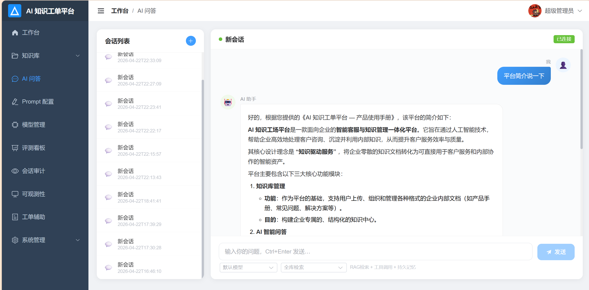
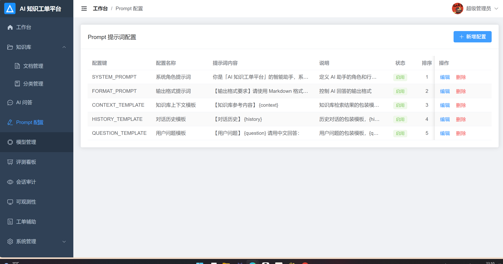
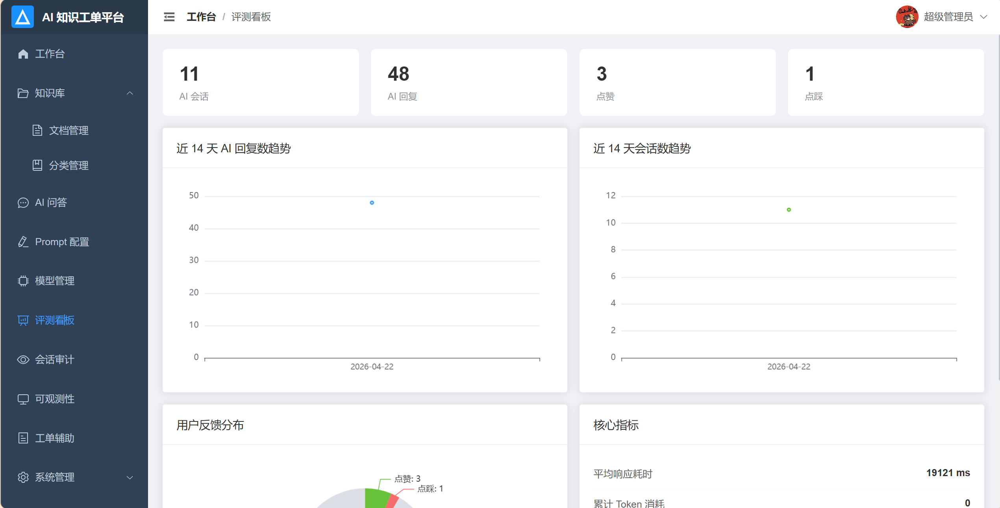

# AI 智能工单系统

基于 **LangChain4j + Spring Boot + Vue 3** 的企业级智能工单与知识管理平台，集成 Agent 工具调用、RAG 检索增强生成、工单 AI 辅助三大核心能力。







## 核心特性

### Agent 两阶段流式架构
Phase 1 同步执行工具调用收集上下文，Phase 2 通过 SSE 逐 token 流式生成，解决 LLM 工具调用与流式输出不兼容的工程难题。

### RAG 知识库全链路
文档上传 → 语义切片(500字/片, 50字重叠) → ONNX 本地向量化 / 远程 API → 语义检索 → Prompt 注入。支持本地与远程 Embedding 模型灵活切换。

### 7 个 AI Agent 工具
将知识库检索封装为 `@Tool`，与工单查询、系统统计等工具统一编排，LLM 自主决策调用，消除 RAG/Agent 模式割裂。

### 知识库未命中 Guardrail
当知识库检索无结果时，系统拦截 LLM 自由发挥，返回固定引导答复，避免编造公司内部制度与数据。

### 持久化多轮对话记忆
自定义 `ChatMemoryStore` 实现，自动过滤工具调用中间消息，同一会话内保持多轮上下文连续性。

### 两级缓存加速
Caffeine 本地缓存 + 热点问题缓存(30 分钟 TTL)，重复问题即时返回，减少 LLM 调用成本。

### 工单 AI 辅助
AI 自动摘要、智能回复建议、多字段关键词检索（标题 / 客户名 / 内容 / 工单号）。

### 敏感词双向过滤
用户输入与 AI 输出双重敏感词检测替换，保障内容安全合规。

### 全链路可观测
AI 调用链日志追踪（traceId → Embedding → Retrieval → LLM），评测看板统计响应时间、Token 用量与满意度。

## 技术栈

| 层级 | 技术 | 说明 |
|------|------|------|
| **前端** | Vue 3 + Element Plus + Vite | 组合式 API、Markdown 渲染、SSE 流式接收 |
| **状态管理** | Pinia | 用户信息、会话状态 |
| **路由** | Vue Router 4 | 动态路由、导航守卫 |
| **后端** | Spring Boot 3.2 + Java 17 | RESTful API |
| **ORM** | MyBatis | 注解式 SQL |
| **数据库** | MySQL 8.0 | 业务数据持久化 |
| **AI 框架** | LangChain4j 0.35.0 | Agent、Tool、Memory、Streaming |
| **LLM** | OpenAI 兼容 API | 支持多模型动态切换（DeepSeek、GPT、Qwen 等） |
| **向量化** | AllMiniLmL6V2 (ONNX) / 远程 API | 本地 384 维 / 远程中文 Embedding |
| **向量库** | InMemoryEmbeddingStore | 内存向量检索 |
| **缓存** | Caffeine | 热点问题缓存、工具调用缓存 |
| **认证** | JWT | 无状态 Token 认证 |
| **接口文档** | Swagger / OpenAPI 3 | 自动生成 API 文档 |
| **部署** | Docker Compose | 一键构建启动 |

## 项目结构

```
├── backend/
│   ├── src/main/java/com/admin/
│   │   ├── annotation/              # 自定义注解（操作日志等）
│   │   ├── aspect/                  # AOP 切面
│   │   ├── config/                  # AiModelConfig, WebMvc, JWT, CORS, RateLimit...
│   │   ├── controller/              # 16 个 Controller
│   │   │   ├── AiChatController     # Agent 流式问答、检索测试、反馈评价
│   │   │   ├── AiConversationController  # 会话 CRUD、消息查询
│   │   │   ├── AiModelConfigController   # AI 模型配置管理
│   │   │   ├── AiPromptConfigController  # Prompt 模板管理
│   │   │   ├── AiStatsController    # 评测统计看板
│   │   │   ├── AiAuditController    # 对话审计回溯
│   │   │   ├── TicketController     # 工单管理 + AI 辅助
│   │   │   ├── KbDocumentController # 知识库文档管理
│   │   │   ├── KbCategoryController # 知识库分类管理
│   │   │   ├── AuthController       # 用户认证
│   │   │   └── User/Role/File/OperLog/SensitiveWord/...  # 系统管理
│   │   ├── dto/                     # 请求/响应 DTO
│   │   ├── entity/                  # 实体类
│   │   ├── mapper/                  # MyBatis Mapper（注解式 SQL）
│   │   ├── service/
│   │   │   ├── AiChatService        # RAG 检索 + 流式问答
│   │   │   ├── AiToolService        # 7 个 @Tool 工具方法
│   │   │   ├── AiAssistant          # 工单 AI 辅助（摘要、回复建议）
│   │   │   ├── PersistentChatMemoryStore  # 持久化对话记忆
│   │   │   ├── KnowledgeRetrievalService  # 混合检索（语义+关键词）
│   │   │   ├── SemanticChunkService # 语义切片
│   │   │   ├── KbDocumentService    # 文档解析与向量索引
│   │   │   ├── TwoLevelCacheService # Caffeine 两级缓存
│   │   │   ├── SensitiveWordService # 敏感词过滤
│   │   │   ├── ShortTermMemoryService    # 短期记忆（会话级）
│   │   │   ├── LongTermMemoryService     # 长期记忆（用户级）
│   │   │   ├── AiCallLogService     # AI 调用链日志（traceId 追踪）
│   │   │   └── TicketService        # 工单业务逻辑
│   │   └── util/                    # 工具类
│   ├── src/main/resources/
│   │   ├── application.yml          # 主配置（敏感值引用 .env）
│   │   └── sql/                     # 数据库建表脚本
│   ├── .env.example                 # 环境变量模板
│   ├── Dockerfile
│   └── pom.xml
│
├── frontend/
│   ├── src/
│   │   ├── api/                     # 16 个 API 模块
│   │   ├── layout/                  # 侧边栏 + 顶栏布局
│   │   ├── router/                  # 路由配置
│   │   ├── stores/                  # Pinia 状态管理
│   │   └── views/
│   │       ├── ai/chat/             # AI 问答（Agent 流式对话）
│   │       ├── ai/stats/            # 评测看板
│   │       ├── ai/audit/            # 会话审计
│   │       ├── ai/observability/    # 可观测性（调用链追踪）
│   │       ├── ai/model/            # 模型配置管理
│   │       ├── ai/prompt/           # Prompt 模板管理
│   │       ├── knowledge/           # 知识库文档 + 分类管理
│   │       ├── ticket/              # 工单管理 + AI 辅助
│   │       ├── system/              # 用户、角色、文件、日志、敏感词
│   │       ├── dashboard/           # 系统首页仪表盘
│   │       ├── login/               # 登录注册
│   │       └── profile/             # 个人中心
│   ├── Dockerfile
│   ├── nginx.conf
│   ├── package.json
│   └── vite.config.js
│
├── sample_docs/                     # 示例知识库文档
├── sample_knowledge.txt             # 示例知识文本
├── docker-compose.yml               # Docker 一键部署
└── DEPLOY.md                        # 宝塔面板部署指南
```

## 快速开始

### 环境要求

- **Java** >= 17
- **Maven** >= 3.8
- **Node.js** >= 18
- **MySQL** >= 8.0

### 1. 初始化数据库

```sql
CREATE DATABASE IF NOT EXISTS reg_zhishiku DEFAULT CHARACTER SET utf8mb4;
```

导入建表脚本：

```bash
mysql -u root -p reg_zhishiku < backend/src/main/resources/sql/reg_zhishiku.sql
mysql -u root -p reg_zhishiku < backend/src/main/resources/sql/alter_hybrid_retrieval.sql
mysql -u root -p reg_zhishiku < backend/src/main/resources/sql/create_ai_long_term_memory.sql
```

### 2. 配置环境变量

```bash
cd backend
cp .env.example .env
```

编辑 `.env`：

```properties
# 数据库
DB_HOST=localhost
DB_PORT=3306
DB_NAME=reg_zhishiku
DB_USERNAME=root
DB_PASSWORD=your_password

# JWT
JWT_SECRET=your_jwt_secret_base64

# AI 模型
AI_BASE_URL=https://api.openai.com/v1
AI_API_KEY=your_api_key
AI_MODEL_NAME=gpt-4o

# Embedding 模型（local=本地ONNX, api=远程API）
EMBEDDING_TYPE=local
EMBEDDING_BASE_URL=
EMBEDDING_API_KEY=
EMBEDDING_MODEL_NAME=text-embedding-v1
```

> `EMBEDDING_TYPE=api` 时，若 `EMBEDDING_BASE_URL` / `EMBEDDING_API_KEY` 留空，自动复用 `AI_BASE_URL` / `AI_API_KEY`。

### 3. 启动后端

```bash
cd backend
mvn spring-boot:run
```

后端服务启动于 http://localhost:8080 ，Swagger 文档见 http://localhost:8080/doc.html。

### 4. 启动前端

```bash
cd frontend
npm install
npm run dev
```

前端服务启动于 http://localhost:3000。

### 5. 知识库初始化（可选）

启动后调用索引接口构建向量库：

```bash
curl -X POST http://localhost:8080/api/ai/chat/index?mode=REBUILD_ALL
```

### 演示账号

| 用户名 | 密码 | 角色 |
|--------|------|------|
| admin | admin123 | 超级管理员 |
| user | user123 | 普通用户 |

## Docker 一键部署

```bash
# 1. 配置环境变量
cp backend/.env.example backend/.env
vi backend/.env

# 2. 构建并启动
docker compose up -d --build

# 3. 查看运行状态
docker compose ps
docker compose logs -f backend
```

服务端口映射：

| 容器 | 外部端口 | 说明 |
|------|---------|------|
| gongdan-frontend | 3313 | Nginx + Vue 前端 |
| gongdan-backend | — | Spring Boot 后端（内部 8080） |

浏览器访问 `http://localhost:3313`。

> 宝塔面板部署请参阅 [DEPLOY.md](DEPLOY.md)。

## 架构设计

### Agent 三阶段流式架构

```
用户提问
  │
  ▼
Phase 1: 同步工具调用（ChatLanguageModel）
  ├─ LLM 判断所需工具 → 调用 searchKnowledge / searchTickets ...
  ├─ 收集工具返回文本 → toolContext
  └─ 最多循环 3 轮
  │
  ▼
Phase 1.5: 强制知识库兜底检索
  ├─ LLM 未调用知识库工具 或 调用后未命中
  ├─ 强制执行 searchKnowledge 确保知识库被检索
  └─ 命中 → 补充 toolContext | 未命中 → 返回固定引导答复
  │
  ▼
Phase 2: 流式生成（StreamingChatLanguageModel + SSE）
  ├─ 构建消息: 历史记录 + SystemMessage(toolContext) + UserMessage
  ├─ 逐 token 通过 SSE 推送至前端
  └─ 完成后保存 USER + ASSISTANT 到持久化记忆
  │
  ▼
前端实时渲染 Markdown（含思考动画 + 消息来源标签）
```

### 知识库 RAG 流程

```
文档上传 → 语义切片 → Embedding(ONNX/远程API) → InMemory 向量库
                                                      │
用户提问 → Embedding → 混合检索(Top5, minScore=0.5) → Guardrail → Prompt注入 → LLM生成
```

### 工具调用流程

```
用户问题 → LLM 判断工具需求
              ├─ searchKnowledge    → 知识库语义检索
              ├─ searchTickets      → 工单关键词搜索
              ├─ queryTicketByNo    → 按工单号查询
              ├─ listKnowledgeDocuments → 文档列表
              ├─ queryDocumentById  → 文档详情查询
              ├─ querySystemStats   → 系统统计概览
              └─ searchDocumentContent → 指定文档内检索
```

## Agent 工具列表

| 工具 | 参数 | 说明 |
|------|------|------|
| `searchKnowledge` | query | 知识库混合检索（语义 + 关键词），返回最相关片段及来源 |
| `searchTickets` | keyword | 按关键词搜索工单（标题/客户名/内容/工单号） |
| `queryTicketByNo` | ticketNo | 按工单编号查询详情 |
| `searchDocumentContent` | documentId, query | 在指定文档内检索 |
| `queryDocumentById` | documentId | 查询知识库文档详情 |
| `listKnowledgeDocuments` | — | 获取启用的知识库文档列表 |
| `querySystemStats` | — | 查询系统统计概览 |

## API 接口

### AI 对话

| 方法 | 路径 | 说明 |
|------|------|------|
| POST | `/api/ai/chat/agent/stream` | Agent 流式问答 (SSE) |
| POST | `/api/ai/chat/stream` | RAG 流式问答 (SSE) |
| POST | `/api/ai/chat` | 普通同步问答 |
| POST | `/api/ai/chat/index` | 触发知识库索引重建 |
| POST | `/api/ai/chat/retrieval-test` | 检索效果测试 |
| PUT | `/api/ai/chat/message/{id}/feedback` | 消息点赞/踩 |

### 会话管理

| 方法 | 路径 | 说明 |
|------|------|------|
| GET | `/api/ai/conversation/list` | 用户会话列表 |
| GET | `/api/ai/conversation/{id}` | 会话详情 |
| POST | `/api/ai/conversation` | 新建会话 |
| PUT | `/api/ai/conversation` | 更新会话 |
| DELETE | `/api/ai/conversation/{id}` | 删除会话 |
| GET | `/api/ai/conversation/{id}/messages` | 会话消息列表 |

### 知识库

| 方法 | 路径 | 说明 |
|------|------|------|
| GET | `/api/kb/document/list` | 文档列表（支持分页、搜索、分类筛选） |
| POST | `/api/kb/document/upload` | 上传文档（TXT/MD/CSV） |
| GET | `/api/kb/document/{id}` | 文档详情 |
| GET | `/api/kb/document/{id}/content` | 文档原始内容 |
| PUT | `/api/kb/document/{id}` | 更新文档 |
| DELETE | `/api/kb/document/{id}` | 删除文档 |
| PUT | `/api/kb/document/{id}/status` | 启用/禁用文档 |
| GET | `/api/kb/category/list` | 分类列表 |
| POST | `/api/kb/category` | 新建分类 |

### 工单

| 方法 | 路径 | 说明 |
|------|------|------|
| GET | `/api/ticket/list` | 工单列表 |
| POST | `/api/ticket` | 创建工单 |
| PUT | `/api/ticket/{id}` | 更新工单 |
| DELETE | `/api/ticket/{id}` | 删除工单 |
| POST | `/api/ticket/{id}/ai-assist` | AI 辅助（摘要 + 回复建议） |

### 系统管理

| 方法 | 路径 | 说明 |
|------|------|------|
| POST | `/api/auth/login` | 用户登录 |
| GET | `/api/auth/info` | 当前用户信息 |
| GET/POST/PUT/DELETE | `/api/user/*` | 用户管理 |
| GET/POST/PUT/DELETE | `/api/role/*` | 角色管理 |
| POST | `/api/file/upload` | 文件上传 |
| GET | `/api/oper-log/*` | 操作日志 |
| GET/POST/PUT/DELETE | `/api/sensitive-word/*` | 敏感词管理 |
| GET/POST/PUT | `/api/ai/model-config/*` | AI 模型配置 |
| GET/POST/PUT | `/api/ai/prompt-config/*` | Prompt 模板配置 |
| GET | `/api/ai/stats/*` | 评测统计数据 |
| GET | `/api/ai/audit/*` | 对话审计查询 |
| GET | `/api/ai/call-log/*` | AI 调用链日志 |
| GET | `/api/dashboard/*` | 仪表盘数据 |

## 配置说明

### 环境变量

所有敏感配置通过 `.env` 文件管理，`spring-dotenv` 自动加载，`application.yml` 中以 `${env.VAR}` 引用。`.env` 已被 `.gitignore` 排除，不会提交到仓库。

### Embedding 模型切换

| 变量 | 说明 | 默认值 |
|------|------|--------|
| `EMBEDDING_TYPE` | `local` = 本地 ONNX / `api` = 远程 API | `local` |
| `EMBEDDING_BASE_URL` | 远程 API 地址（留空复用 `AI_BASE_URL`） | — |
| `EMBEDDING_API_KEY` | 远程 API Key（留空复用 `AI_API_KEY`） | — |
| `EMBEDDING_MODEL_NAME` | 远程模型名称 | `text-embedding-v1` |

启动日志会打印当前使用的 Embedding 模型类型，便于确认。

### 多模型管理与 Prompt 模板

在系统管理界面可配置多套 AI 模型并动态切换默认模型。Prompt 配置支持系统提示词、格式模板、上下文模板的在线编辑，即时生效无需重启。

## 功能模块总览

| 模块 | 功能描述 |
|------|---------|
| **AI 智能问答** | Agent 流式对话、工具自动调用、多轮记忆、热点缓存、消息来源追溯 |
| **知识库管理** | 文档上传解析、语义切片、向量索引、分类管理、启用/禁用、检索测试 |
| **工单管理** | 工单 CRUD、AI 自动摘要、智能回复建议、多字段检索 |
| **Prompt 配置** | 系统提示词、格式模板在线编辑，即时生效 |
| **模型管理** | 多模型配置、动态切换、默认模型设置 |
| **评测看板** | 响应时间、Token 用量、检索命中率、满意度统计 |
| **会话审计** | 对话历史回溯、消息检索与导出 |
| **可观测性** | AI 调用链日志（traceId → Embedding → Retrieval → LLM） |
| **敏感词过滤** | 输入输出双向过滤，支持词库管理 |
| **系统管理** | 用户管理、角色权限、文件管理、操作日志 |
| **仪表盘** | 系统数据概览首页 |

## License

MIT
